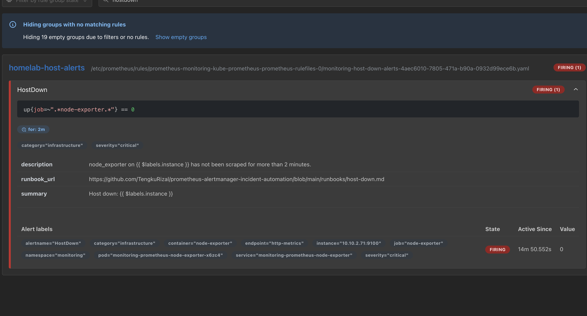
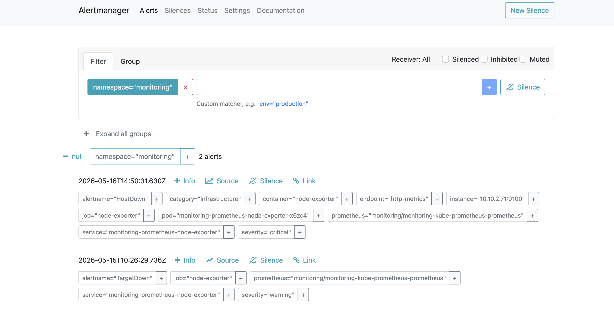
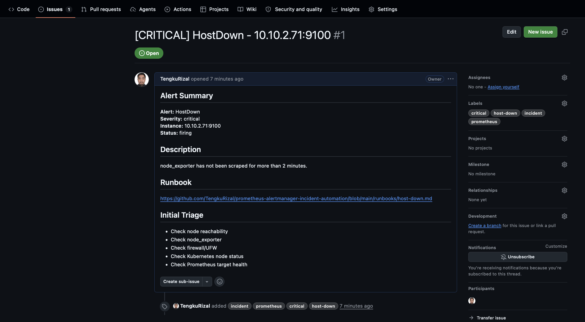

# prometheus-alertmanager-incident-automation

Prometheus and Alertmanager incident automation project for Kubernetes host and service downtime using GitHub Issues and SOAR-style workflow.

This project demonstrates how infrastructure alerts can be detected, routed, documented, and converted into incident tickets as part of a DevOps/SRE incident management workflow.


---

## Overview

This project implements a monitoring and alerting workflow using Prometheus, Alertmanager, Kubernetes, and GitHub Issues.

The first implemented alert detects when a host or Kubernetes node is unreachable through `node_exporter`.

The alert flow:

```text
Kubernetes Node / Host
        ↓
node_exporter
        ↓
Prometheus scrape target
        ↓
PrometheusRule: HostDown
        ↓
Alertmanager
        ↓
SOAR / Webhook workflow
        ↓
GitHub Issue incident ticket
```

---

## Problem Statement

In production environments, host or service downtime must be detected quickly and routed to the correct response workflow.

Without alert automation, teams may face:

- Delayed incident detection
- No standard alert routing
- Manual ticket creation
- Missing incident documentation
- No runbook reference during triage
- Weak audit trail for follow-up actions

This project solves that by connecting Prometheus alert detection with Alertmanager routing and incident ticket creation.

---

## Architecture

```text
Prometheus
  ├── Scrapes node_exporter targets
  ├── Evaluates PrometheusRule alerts
  └── Sends firing alerts to Alertmanager

Alertmanager
  ├── Groups alerts
  ├── Routes alerts by severity and labels
  ├── Supports silencing and inhibition
  └── Sends alerts to webhook/SOAR workflow

SOAR / Webhook Automation
  ├── Receives Alertmanager payload
  ├── Extracts alert labels and annotations
  ├── Adds severity and incident metadata
  └── Creates GitHub Issue incident ticket
```

---

## Alert Flow

```text
HostDown condition detected
        ↓
up{job=~".*node-exporter.*"} == 0
        ↓
Alert remains active for 2 minutes
        ↓
Prometheus marks alert as FIRING
        ↓
Alertmanager receives and groups alert
        ↓
Incident workflow creates GitHub Issue
```

---

## Implemented Alert

| Alert | Expression | Severity | Purpose |
| --- | --- | --- | --- |
| HostDown | `up{job=~".*node-exporter.*"} == 0` | Critical | Detect when Prometheus cannot scrape node_exporter for more than 2 minutes |

---

## Repository Structure

```text
prometheus-alertmanager-incident-automation/
├── README.md
├── prometheus-rules/
│   └── host-down-alerts.yaml
├── alertmanager/
│   └── alertmanager-config-example.yaml
├── runbooks/
│   └── host-down.md
├── screenshots/
│   ├── prometheus-alert-firing.png
│   └── alertmanager-alert.png
└── docs/
    └── interview-explanation.md
```

---

## Screenshots

### Prometheus Alert Firing



### Alertmanager Alert Received



### GitHub Incident Issue Created



---

## Validation Evidence

The `HostDown` alert was successfully created using a `PrometheusRule` resource inside the `monitoring` namespace.

Validation results:

```text
PrometheusRule created: host-down-alerts
Label: release=monitoring
Alert group: homelab-host-alerts
Alert status: FIRING
Affected target: 10.10.2.71:9100
Severity: critical
Alertmanager received alert: yes
```

---

## PrometheusRule Example

```yaml
apiVersion: monitoring.coreos.com/v1
kind: PrometheusRule
metadata:
  name: host-down-alerts
  namespace: monitoring
  labels:
    release: monitoring
spec:
  groups:
    - name: homelab-host-alerts
      rules:
        - alert: HostDown
          expr: up{job=~".*node-exporter.*"} == 0
          for: 2m
          labels:
            severity: critical
            category: infrastructure
          annotations:
            summary: "Host down: {{ $labels.instance }}"
            description: "node_exporter on {{ $labels.instance }} has not been scraped for more than 2 minutes."
            runbook_url: "https://github.com/TengkuRizal/prometheus-alertmanager-incident-automation/blob/main/runbooks/host-down.md"
```

---

## Alertmanager Webhook Example

```yaml
route:
  receiver: shuffle-github-incident
  group_by:
    - alertname
    - instance
  group_wait: 30s
  group_interval: 5m
  repeat_interval: 4h

receivers:
  - name: shuffle-github-incident
    webhook_configs:
      - url: "http://SHUFFLE_URL/api/v1/hooks/YOUR_WEBHOOK_ID"
        send_resolved: true
```

---

## Runbook

A runbook is included for the `HostDown` alert:

[Host Down Runbook](runbooks/host-down.md)

The runbook covers:

- Host reachability check
- SSH access check
- node_exporter check
- Kubernetes node check
- Common root causes
- Resolution steps
- Post-incident follow-up

---

## End-to-End Incident Automation

This project successfully demonstrates an end-to-end incident automation workflow:

```text
Prometheus
↓
Alertmanager
↓
Shuffle SOAR
↓
GitHub Issue
```

## Fintech / MNC Practice Mapping

In a real fintech or MNC environment, critical alerts would normally be routed to tools such as PagerDuty, Opsgenie, Jira Service Management, or ServiceNow for on-call escalation and SLA tracking.

In this homelab project, GitHub Issues and SOAR-style webhook automation are used to simulate incident ticket creation and post-incident engineering follow-up.

| Homelab Implementation | Real Enterprise Equivalent |
| --- | --- |
| Prometheus | Prometheus, Datadog, New Relic, CloudWatch |
| Alertmanager | Alertmanager, PagerDuty, Opsgenie, Jira Service Management |
| GitHub Issue | Jira or ServiceNow incident ticket |
| Runbook markdown | Confluence or internal knowledge base |
| Shuffle SOAR | SOAR or automation workflow |

---

## Interview Talking Points

This project demonstrates:

- Prometheus alert rule creation using `PrometheusRule`
- Alertmanager alert grouping and routing
- Host down detection using `node_exporter`
- Kubernetes observability with kube-prometheus-stack
- Incident workflow design
- Runbook-driven response
- GitHub Issues as incident ticket simulation
- Enterprise-style alerting mapped to homelab tools

Example explanation:

> I built this project to simulate a production-style incident workflow. Prometheus detects when a host or Kubernetes node is unreachable through node_exporter. The alert is evaluated using a PrometheusRule and routed to Alertmanager. Alertmanager groups the alert and can forward it to a SOAR or webhook workflow, where an incident ticket can be created in GitHub Issues with severity, affected instance, and runbook link.

---

## Documentation

- [Interview Explanation](docs/interview-explanation.md)
- [Host Down Runbook](runbooks/host-down.md)
- [Host Down PrometheusRule](prometheus-rules/host-down-alerts.yaml)
- [Alertmanager Config Example](alertmanager/alertmanager-config-example.yaml)

---

## Future Improvements

- Add Shuffle webhook workflow
- Create GitHub Issue automatically from Alertmanager alerts
- Add blackbox_exporter for HTTP/TCP service availability checks
- Add service down alert for GitLab, Grafana, Wazuh, and demo-nginx
- Add Alertmanager route based on severity
- Add alert silence and maintenance window documentation
- Add Grafana dashboard for incident overview
- Add resolved alert workflow
- Add labels to GitHub Issues automatically
- Add runbooks for service down and Kubernetes node not ready

---

## Author

**Tengku Rizal** — DevSecOps Engineer  
Building: GitLab CI/CD · Kubernetes · Wazuh SIEM · Terraform · Security Automation  
Location: Kuala Lumpur, Malaysia
